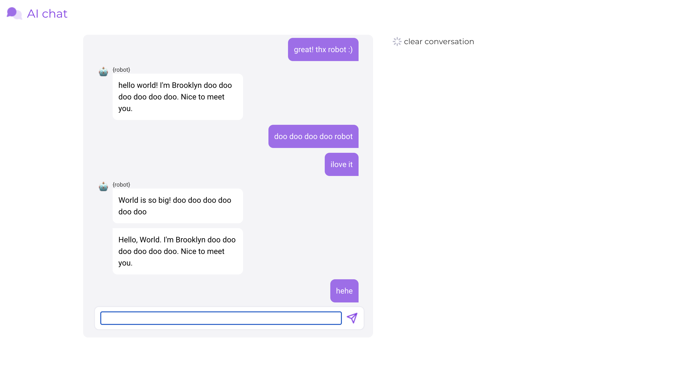
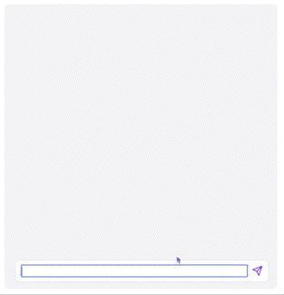

# 커먼컴퓨터 프론트엔드 면접과제 - 20181593 김재하

This project was bootstrapped with [Create React App](https://github.com/facebook/create-react-app).

## 실행법

기본적으로 create-react-app를 사용하여 프로젝트를 구성하였습니다. 따라서
터미널에서 해당 레포지토리를 연 뒤, `npm start` 를 입력하시면 로컬 호스트서버가 열리고, 브라우저에서 [http://localhost:3000](http://localhost:3000)를 여시면 제작한 프로젝트를 보실 수 있습니다.

## 실행화면
**(모두 폰트 적용전 화면으로 설명되어 나옵니다!)**  
기본 실행 화면
 

기본 대화 화면
 

'clear convasation' 클릭시
 

 
## 구현 현황

* [x] 스타일링
* [x] 채팅창에 구현
* [x] API를 호출 구현
* [x] clear modal 구현
* [x] 채팅창 초기화 구현

## 추가 기능 구현
기본적으로 ui부분에 있어서는 건드린 부분이 많이 없습니다. 과제에서 요구했던 기능을 모두 구현하였고, 메신저 창을 구현할때, 메신저 창에서 할수있는 행동과 채팅 버블을 약간 수정했습니다.

### 추가기능1 : 채팅 입력시 엔터버튼을 누르면 입력한 채팅 전송

 

키보드를 사용할 수 있는 컴퓨터 화면에서도 버튼을 눌러가며 메세지를 전송해야하니 입력과 전송사이에 걸리는 시간이 너무 오래 걸립니다. 따라서 여타 다른 메신저 앱처럼 엔터키를 누를시 이벤트를 작성하여 똑같이 전송을 할 수 있는 기능을 만들었습니다.
 

### 추가기능2 : 로봇 채팅 버블 수정

 

 모든 로봇 채팅에 프로필 사진과 이름을 달고보니 메세지 창이 전반적으로 깔끔해 보이지 않고 어수선하여 메세지의 내용을 보는데 방해가 되었습니다. 따라서 만약 로봇에서 연속적으로 메세지가 오는경우에, 로봇프로필과 이름은 상위 메세지 버블에만 노출될 수 있도록 구현 하였습니다.

### 추가기능3 : 메신저 저를 받았을시 스크롤 맨 아래로 내리기.

 

 메세지를 전송 받거나, 자신이 메세지를 보낼때 메세지 버블들이 많아 스크롤이 생길때 채팅 입력 화면 아래로 버블이 생겨 일일이 내리면서 확인하는데 불편함이 생깁니다. 따라서 상태가 변경될때마다 스크롤를 맨 아래로 내려 업데이트된 메세지를 한눈에 확인 할 수 있도록 도와줍니다.
